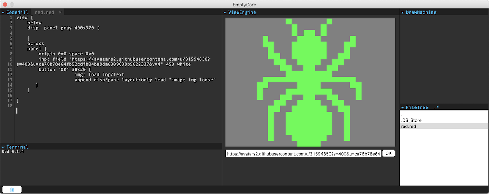
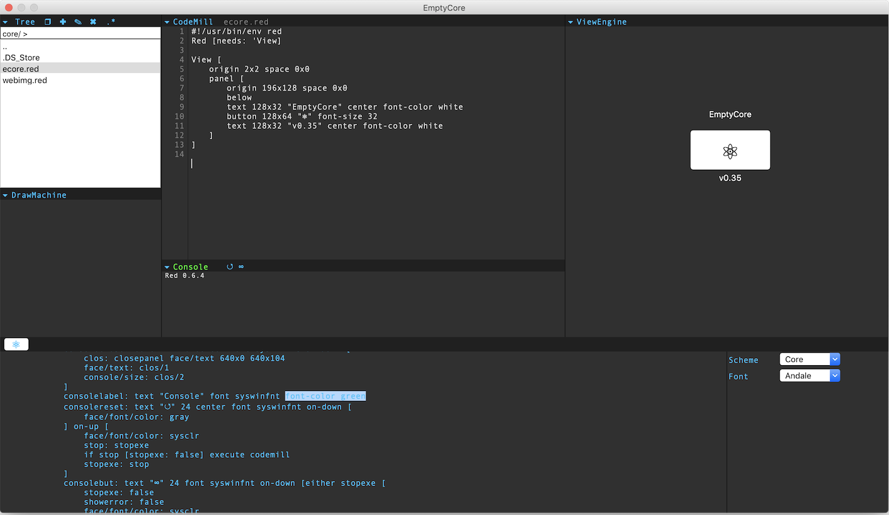

# EmptyCore-Red

WIP

[Red](https://www.red-lang.org)

"EmptyCore" - Experimental LiveCoding Environment

To run source code: clone repository, download & install [Red](https://www.red-lang.org/p/download.html) for you system and run command in shell:

``` bash
red EmptyCore.red
```

With "EmptyCore" you can see result of the executed code in the real-time.



You can see source code and change it on the fly. Be careful.


