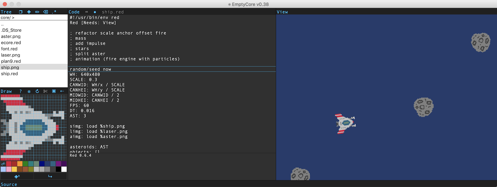
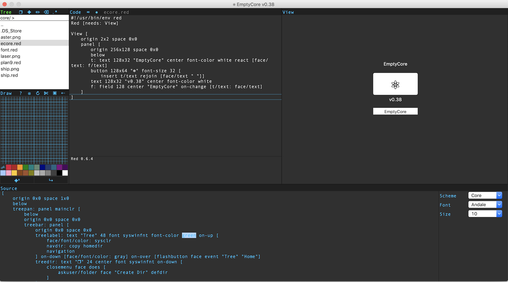

# EmptyCore-Red

WIP

v0.36

"EmptyCore" - Experimental LiveCoding Environment

With "EmptyCore" you can see result of the executed code in a real-time.
You can stop it by pressing ∞ in the Console panel.
If you stop automatic execution you can see error in the Console.
To run code manually press cmd-b or ↺ in Console panel.



You can see source code of the "EmptyCore" and change it on the fly. Be careful.

Function "ask" and "input" not yet implemented.

All variables stay defined until close "EmptyCore". If you define and after comment variable - nothing happen. Variable saved in the memmory.



[Inspired by Red Programming Language](https://www.red-lang.org)

To run source code: clone repository, download & install [Red](https://www.red-lang.org/p/download.html) for you system and run command in shell:

``` bash
red EmptyCore.red
```

v0.36

- simple file tree

- code editor

- source code viewer/editor

- console output

- VID output

- show errors in console

- arrow navigation in file tree

- fix key word parsing "view" "print" "probe" "prin"

- fix View reactor

- hotkeys cmd-q quit cmd-s save cmd-b build esc close dialog window

v0.4

- font size panel

- save user setting for source code and run after main programm

- draw machine

- close button for file in code editor

- tree focus problem

- custom file tree?

- resize panels?

- improve numbers


v0.5

- compile user projects for diferent systems

- improve "ask" "input" "about" "help"

- syntax color for editor

- show line error


